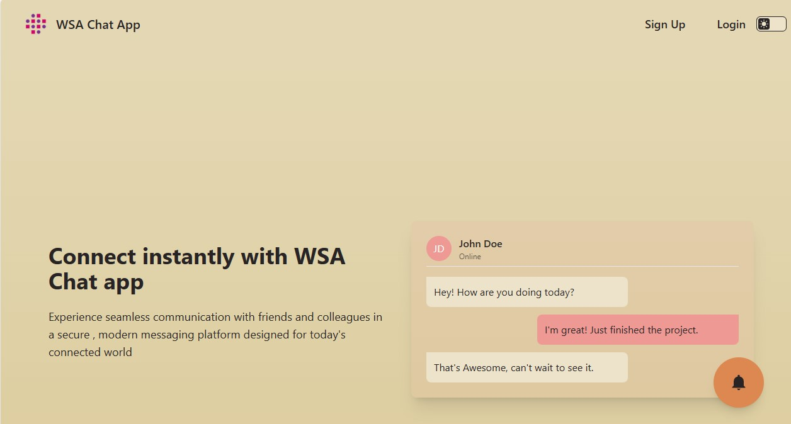

# WSA Chatty App

**Chatty App** is a real-time chat application built using the **MERN stack** with **Socket.IO** for instant messaging and **Clerk** for authentication.  
It allows users to sign up, log in, chat with other users in real-time (including image sharing), and see online/offline status updates.

---

## 🛠️ Tech Stack

<p align="left">
  
  
  
  
  
  
   
  
</p>

---

## ✨ Key Features

- **Clerk Authentication** – Secure login & signup  
- **Real-time Messaging** – Instant text and image messages using Socket.IO  
- **ImageKit Integration** – Store and serve chat images from the cloud  
- **Online/Offline Status** – See when users are active  
- **Zustand State Management** – Lightweight global state handling  
- **TailwindCSS + DaisyUI** – Modern, responsive UI styling  

---

## Screenshot:


**Live Demo** : [Click here to view the app](https://wsa-chatty-app.netlify.app/)

---

## 📁 Folder Structure
├── frontend  
└── backend  

- **frontend/** → React app with Zustand, TailwindCSS, Clerk, and Socket.IO client  
- **backend/** → Node.js & Express server with Socket.IO, MongoDB, and Clerk integration  

---

## 📌 How to Run Locally

1️⃣ **Clone the Repository:**
```bash
git clone <REPOSITORY_URL>
cd wsa-chatty-app
```
2️⃣ **Install Dependencies:**
```
# Frontend
cd frontend
npm install

# Backend
cd ../backend
npm install

```
3️⃣ **Configure Environment Variables:**
<br><br>
Backend (.env)
```
PORT=7000
MONGODB_URL=your_mongodb_connection_string

CLERK_PUBLISHABLE_KEY=your_clerk_publishable_key
CLERK_SECRET_KEY=your_clerk_secret_key
CLERK_WEBHOOK_SECRET_KEY=your_clerk_webhook_secret

IMAGEKIT_PUBLIC_KEY=your_imagekit_public_key
IMAGEKIT_PRIVATE_KEY=your_imagekit_private_key
IMAGEKIT_URL_ENDPOINT=your_imagekit_url_endpoint
```
Frontend (.env)
```
VITE_CLERK_PUBLISHABLE_KEY=your_clerk_publishable_key
```
4️⃣ **Run the Application:**
```
# Backend
cd backend
npm start

# Frontend
cd ../frontend
npm run dev
```

**⚠️ For Clerk setup, please follow the project teaching scripts provided by WSA.**

## 📄 License
© 2023 WSA. All rights reserved.
